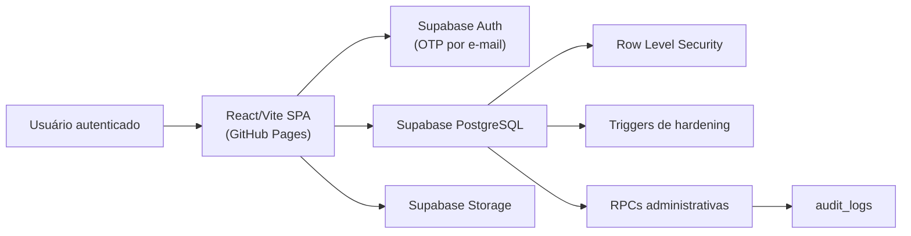

# Arquitetura — Bolão Suprema

## Visão geral

O Bolão Suprema é uma Single Page Application (SPA) estática hospedada no GitHub Pages. Não há servidor de aplicação próprio — toda a lógica de back-end é provida pelo Supabase.



## Frontend (React/Vite SPA)

### Por que HashRouter

GitHub Pages não suporta reescritas de URL no servidor. O HashRouter usa o fragmento da URL (`/#/rota`) para navegação, o que funciona sem configuração de servidor adicional.

### Estrutura de diretórios

```
src/
  App.tsx              # Roteador principal + guards de autenticação
  screens/             # Uma pasta por tela (Home, Prediction, Ranking, etc.)
  stores/              # Zustand stores (auth, prediction, chat, boletim, bracket)
  lib/
    supabase.ts        # Cliente Supabase + utilitários de upload
    security.ts        # Helpers de segurança (validação de URL, clamp de texto)
    utils.ts           # Utilitários gerais
  components/
    navigation/        # MobileNav, DesktopNav
    shared/            # Componentes reutilizáveis (Avatar, Flag, Marquee, etc.)
  data/
    teams.ts           # 48 seleções da Copa 2026
    wc2026.ts          # Estrutura do torneio
    mock.ts            # Dados mock para desenvolvimento sem Supabase
  types/index.ts       # Tipos TypeScript do projeto
  hooks/               # Hooks customizados
```

### Gerenciamento de estado (Zustand)

Cada domínio tem seu próprio store:

| Store | Responsabilidade |
|-------|-----------------|
| `auth.store.ts` | Sessão, perfil, `profileComplete`, `updateProfile` |
| `prediction.store.ts` | Palpites de partidas + apostas gerais |
| `bracket.store.ts` | Palpites de chaveamento |
| `chat.store.ts` | Mensagens em tempo real, enquetes, pins |
| `boletim.store.ts` | Boletins com Realtime |
| `match.store.ts` | Estado de partidas com Realtime |

Stores com `persist` (Zustand middleware) salvam estado no localStorage para sobreviver a recarregamentos.

### Guards de rota

`RequireAuth` em `App.tsx` aplica as regras:

1. Sessão carregando → tela de carregamento.
2. Não autenticado → `/login`.
3. Autenticado sem perfil completo → `/setup`.
4. Participante bloqueado → tela de bloqueio.
5. Demais → acesso liberado.

## Supabase Auth

- Método: OTP por e-mail (Magic Link desabilitado — apenas código de 6 dígitos).
- Domínio restrito: `@suprema.group`.
- JWT é armazenado pelo cliente Supabase e enviado automaticamente em cada requisição.
- O trigger `handle_new_user` cria automaticamente um registro em `public.users` ao criar uma nova conta.

## Supabase Database

### RLS (Row Level Security)

Todas as tabelas têm RLS habilitado. Exemplo de política:

- `users`: usuário lê o próprio perfil + perfis públicos; admin lê todos.
- `predictions`: usuário lê/escreve os próprios palpites; outros leem apenas palpites de partidas encerradas.
- `chat_messages`: todos os autenticados leem; cada usuário escreve as próprias mensagens.
- `matches`: todos os autenticados leem; apenas admin altera.

### Triggers de hardening

| Trigger | Tabela | Ação |
|---------|--------|------|
| `trg_prevent_user_privilege_escalation` | `users` | Bloqueia update de campos privilegiados por não-admin |
| `trg_predictions_market_open` | `predictions` | Bloqueia palpite quando mercado não está aberto |
| `trg_handle_updated_at` | Várias | Atualiza `updated_at` automaticamente |

### RPCs administrativas

Funções com `security definer` que encapsulam ações sensíveis:

| RPC | Permissão necessária |
|-----|---------------------|
| `set_match_market_status` | admin |
| `settle_match_result` | admin |
| `refresh_ranking_snapshots` | admin |
| `moderate_chat_message` | admin |
| `update_participant_status` | admin |
| `log_audit` | authenticated (uso interno) |

### Migrations

Armazenadas em `supabase/migrations/` com timestamp no nome. Devem ser aplicadas em ordem cronológica.

## Supabase Storage

| Bucket | Uso | Limite | MIMEs aceitos |
|--------|-----|--------|---------------|
| `avatars` | Fotos de perfil | 5 MB | JPEG, PNG, WebP, GIF |
| `banners` | Banners de perfil | 5 MB | JPEG, PNG, WebP, GIF |
| `bulletins` | Imagens de boletins | 5 MB | JPEG, PNG, WebP, GIF |
| `chat-media` | Imagens e áudios do chat | 8/10 MB | Imagem + áudio |
| `user-media` | Legado | 5 MB | JPEG, PNG, WebP, GIF |

Caminhos no storage são sempre `{userId}/{filename}` para garantir isolamento por usuário.

## Fluxo de dados — palpite de partida

```
Usuário → PredictionScreen
  → prediction.store.savePrediction(matchCode, homeScore, awayScore)
  → supabase.from('predictions').upsert(...)
  → PostgreSQL: trigger trg_predictions_market_open verifica mercado
  → RLS verifica se é o próprio usuário
  → Salvo; Realtime propaga para outros clientes
```

## Deploy

```
Push para main
  → GitHub Actions (deploy.yml)
  → npm ci + npm run build
  → Publicar dist/ na branch gh-pages
  → GitHub Pages serve os arquivos estáticos
```

## Considerações de escalabilidade

O app foi projetado para ~300 participantes. Para escalar além disso:

- Verificar limites de Realtime do plano Supabase (conexões simultâneas).
- Considerar debounce/throttle em queries de ranking em tempo real.
- Avaliar se `ranking_snapshots` pode ser atualizado por cron em vez de trigger.
